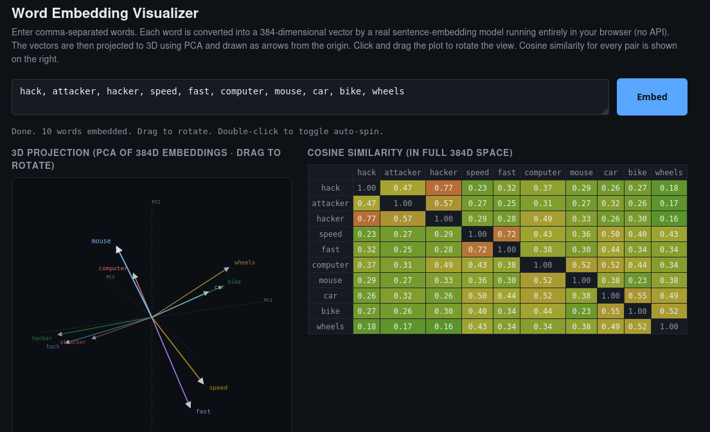

# Word Embedding Visualizer

A tiny self-contained web page that turns words into 384-dimensional vectors and shows them as 3D arrows you can rotate. Runs entirely in your browser, no API key, no server.



## What it does

1. You type a comma-separated list of words.
2. Each word is embedded into a 384-dimensional vector by the `all-MiniLM-L6-v2` model running in your browser via [transformers.js](https://github.com/xenova/transformers.js).
3. PCA reduces the vectors to their top three principal components.
4. The result is rendered as draggable 3D arrows from the origin. Semantically similar words point in similar directions, so they cluster.
5. A full cosine-similarity matrix is shown alongside, computed in the original 384D space (not the projection).

It is intended as a visual companion to the standard explanation of word embeddings, so you can actually *see* what "vectors pointing in similar directions" means.

## Run it

The repo is a single HTML file. No build step.

### Option 1: open the file directly

```bash
git clone https://github.com/HexRav3n/word-embedding-visualizer.git
cd word-embedding-visualizer
xdg-open index.html   # or: open index.html on macOS
```

If your browser blocks ESM imports from `file://` (some Chromium builds do), use Option 2.

### Option 2: serve locally

```bash
cd word-embedding-visualizer
python3 -m http.server 8000
```

Then open `http://localhost:8000`.

## First load

The first time you click **Embed**, the browser downloads the ONNX-quantized embedding model (~25 MB). After that it is cached in IndexedDB and runs offline.

## Controls

| Action | Effect |
|---|---|
| Type words, click **Embed** | Compute embeddings and render |
| Click and drag the plot | Rotate the 3D view |
| Double-click the plot | Toggle auto-spin |
| Ctrl/Cmd + Enter in textarea | Run without clicking |

## How the math works

- **Embedding model:** `Xenova/all-MiniLM-L6-v2`, a small sentence transformer that produces L2-normalized 384D vectors.
- **PCA:** implemented inline via power iteration on the covariance operator. PC2 and PC3 are extracted with successive Gram-Schmidt deflation. This avoids any external matrix library while staying numerically fine for the small word counts this tool targets.
- **3D projection:** Euler rotation around the X and Y axes, then drop the rotated Z. A painter's algorithm depth-sorts arrows so closer ones overdraw farther ones, with opacity and stroke width fading by depth.
- **Cosine similarity:** computed on the original 384D vectors, not the projection, since the projection only preserves rough structure.

## Why it is one file

Every dependency loads from a CDN at runtime. Nothing to install, nothing to build. Copy the file anywhere and it works. The trade-off is the first-load model download.

## License

[MIT](LICENSE)
